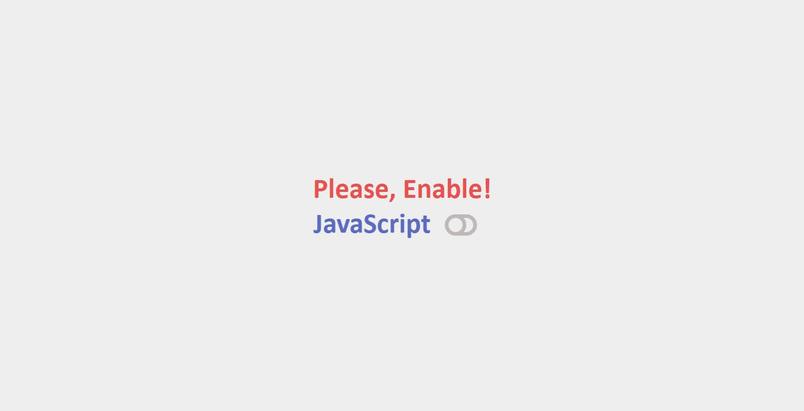

# Enable JavaScript Page:
A simple and animated warning section for no script permission with responsive design. 
It is made with HTML, AnimateCSS, Font Awesome Icons and Bootstrap.

### Screenshots:
Here are some screenshots of the project:

### License
The project is licensed under the MIT License. See the [LICENSE](../../LICENSE) file for more details.

### Contact
If you have any questions or feedback, please feel free to reach me by referring [My Github Profile](https://github.com/ag-sanjjeev/)
